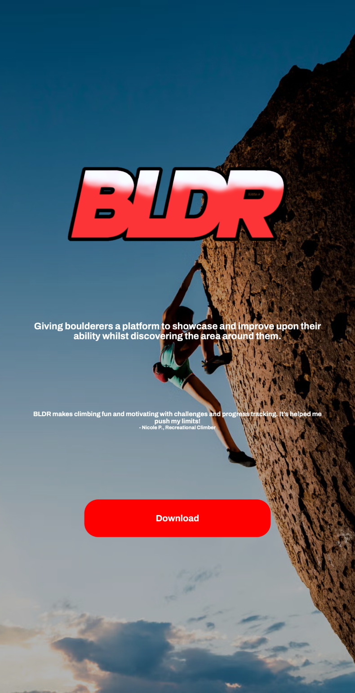
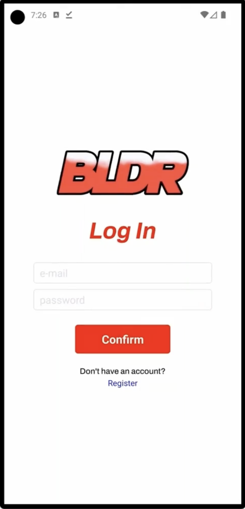
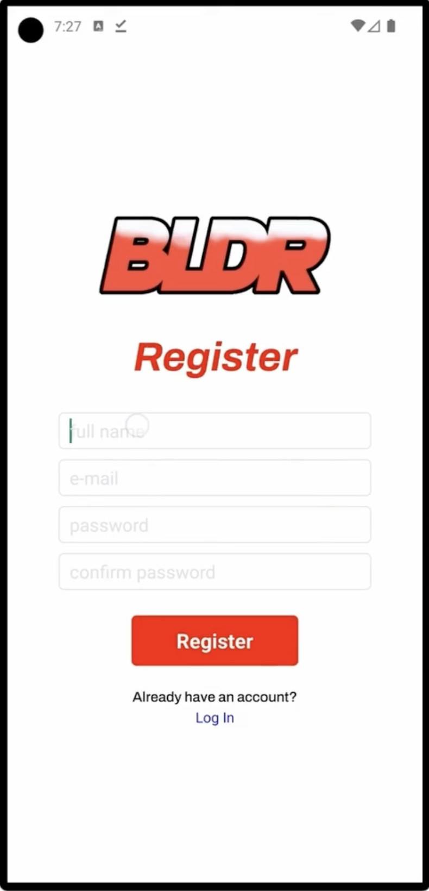
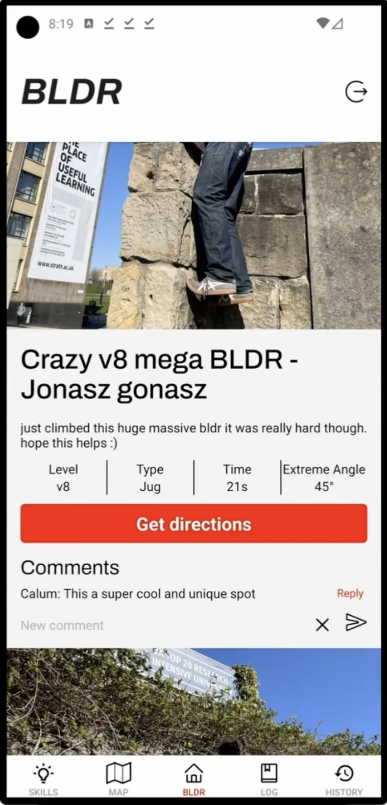
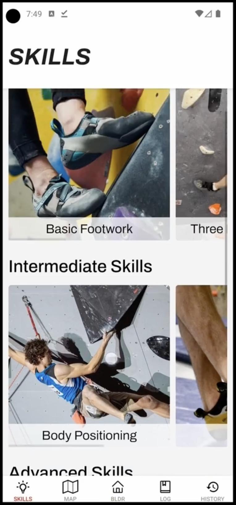
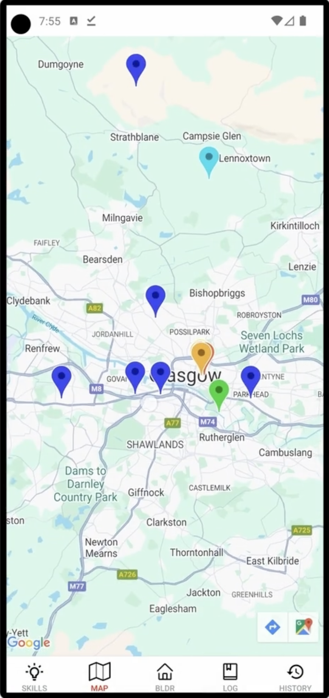
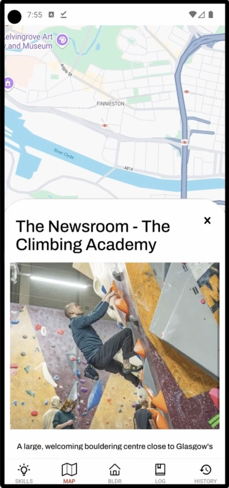
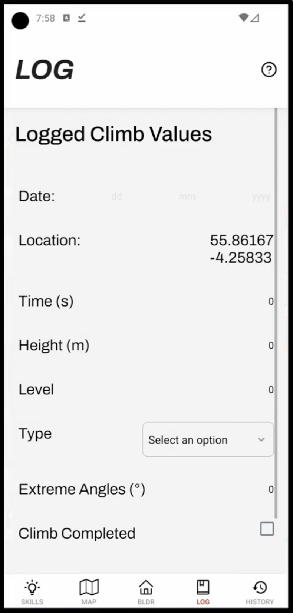
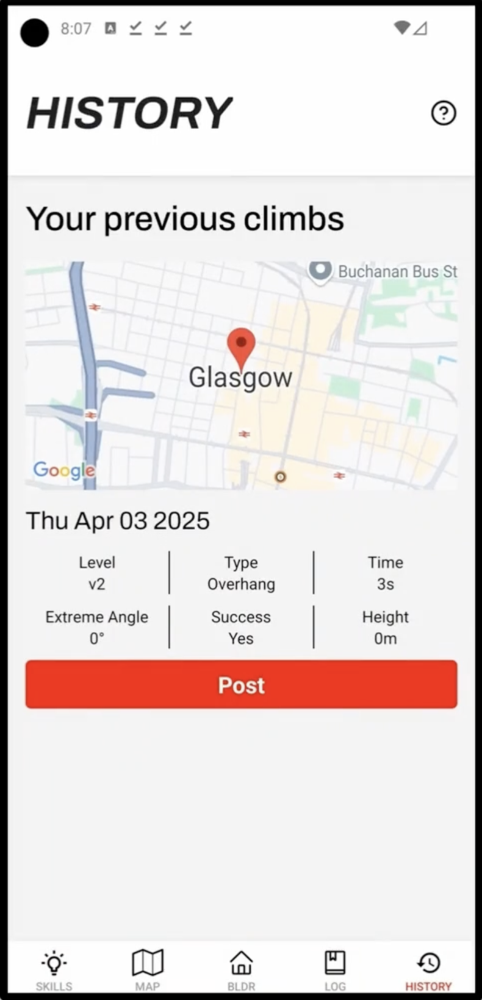
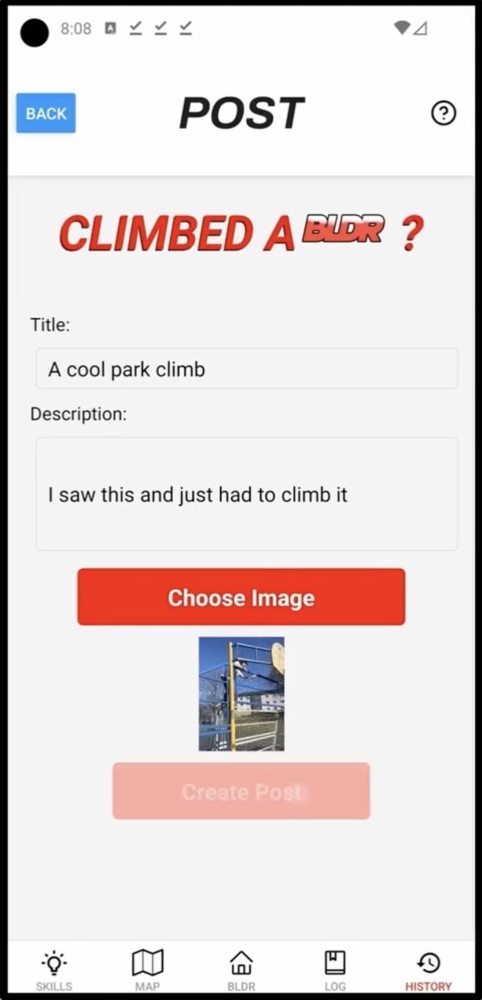

# BLDR

My group's project for: CS317, Mobile App Development

This is the final submission of our group project in CS317: Mobile App Development, completed as part of our academic studies at the University of Strathclyde.

## Features

- Create account
- Discover new boulders around you
- Logging of climbs, using phone sensors
- Share your climbs with others
- Database of skills & resources to help you improve
- Android APK with download page

## Pitch Overview

## Screenshots

| Download                                | Log in                        | Register                           |
| --------------------------------------- | ----------------------------- | ---------------------------------- |
|  |  |  |

| Feed                       | Skills                         | Map                      |
| -------------------------- | ------------------------------ | ------------------------ |
|  |  |  |

| Map location                               | Log climb                      | History                          | Post                       |
| ------------------------------------------ | ------------------------------ | -------------------------------- | -------------------------- |
|  |  |  |  |

## Fellow Contributors

- [Calum Cardownie](https://github.com/calumvc)
- [Mux Diven](https://github.com/muxdiven)
- [Jonasz Gofron](https://github.com/JonaszG)
- Kieran Ballard

## Future additions

- IOS build
- Published to app stores
- Better API security
- Deploy on private server
