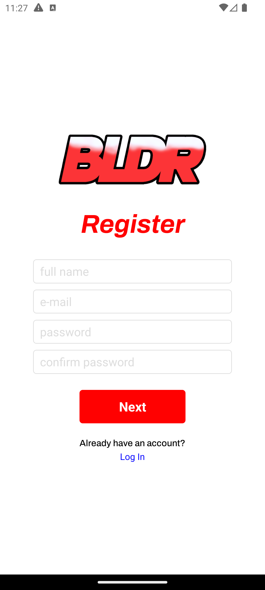
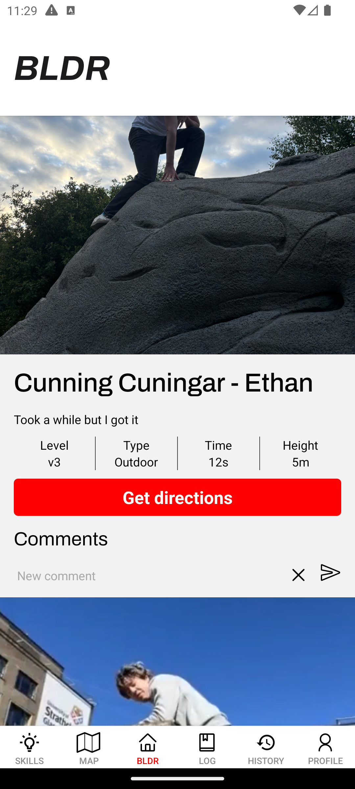
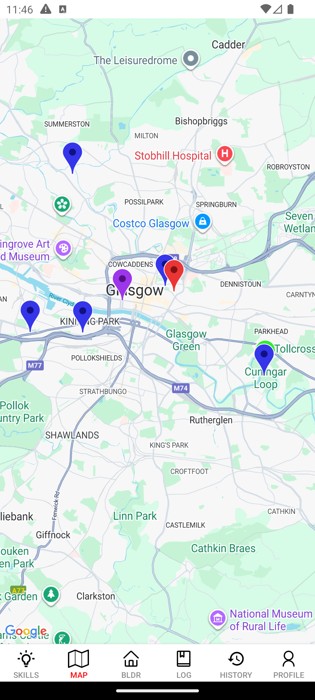
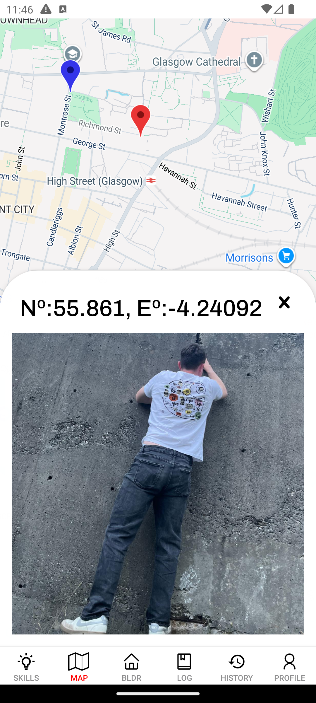
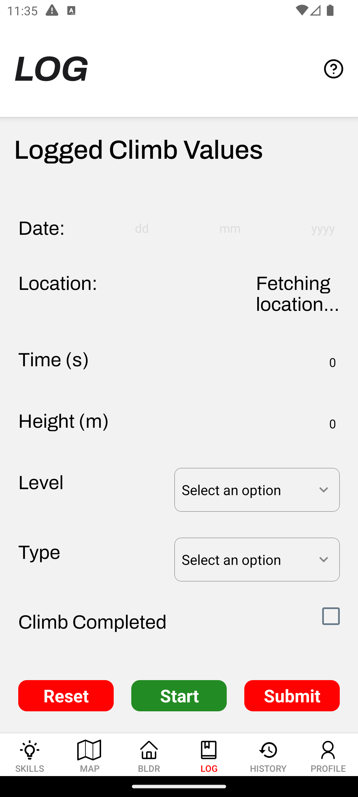
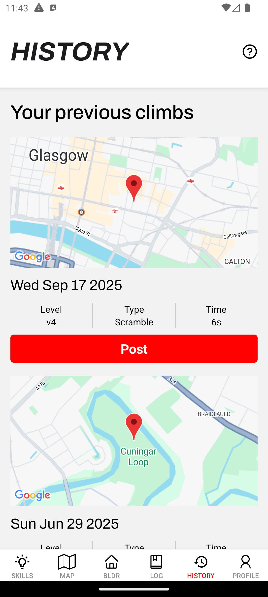
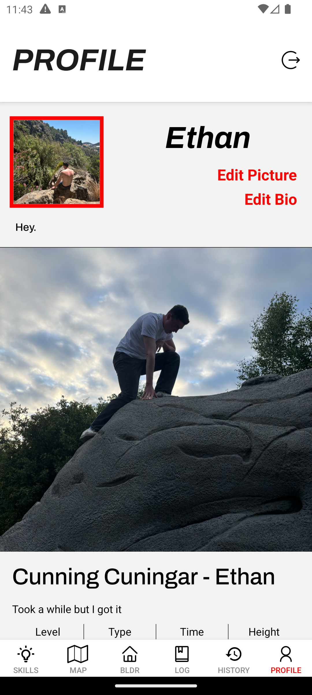

# BLDR

Mobile app built for climbers to connect, improve their skills, share new climbing spots & log climbs.

Extended from my group's project for: CS317, Mobile App Development.

## Features

- Create account
- Discover new boulders around you
- Logging of climbs, using phone sensors
- Share your climbs with others
- Profile page with username and profile picture changing
- Database of skills & resources to help you improve
- Android APK with download page

## Pitch Overview

https://github.com/user-attachments/assets/42535a06-4877-45f4-99f6-3d03e289f063

## Screenshots

| Download                                | Log in                        | Register                           |
| --------------------------------------- | ----------------------------- | ---------------------------------- |
|  |  |  |

| Feed                       | Skills                         | Map                      | Map location                               |
| -------------------------- | ------------------------------ | ------------------------ | ------------------------------------------ |
|  |  |  |  |

| Log climb                      | History                          | Post                       | Profile page                          |
| ------------------------------ | -------------------------------- | -------------------------- | ------------------------------------- |
|  |  |  |  |

## Extended Contributors

- [Calum Cardownie](https://github.com/calumvc)
- [Mux Diven](https://github.com/muxdiven)

## Original Contributors

- [Calum Cardownie](https://github.com/calumvc)
- [Mux Diven](https://github.com/muxdiven)
- [Jonasz Gofron](https://github.com/JonaszG)
- Kieran Ballard
